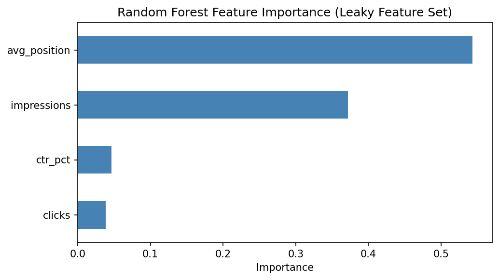
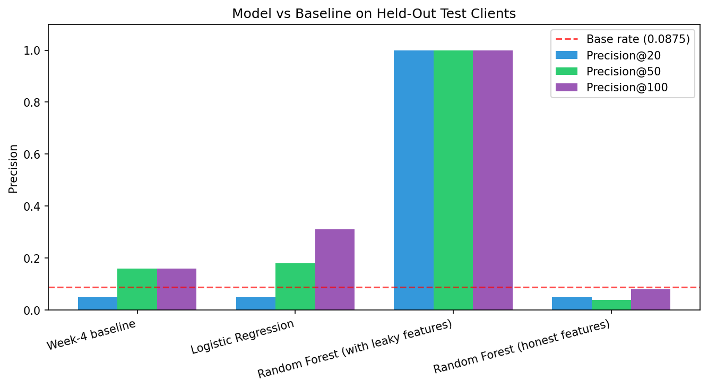
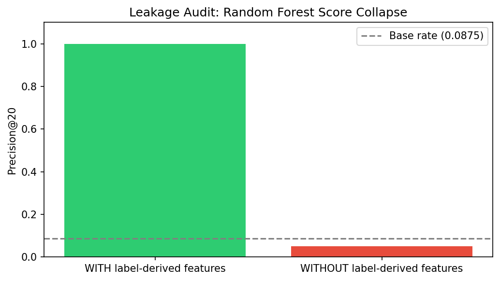
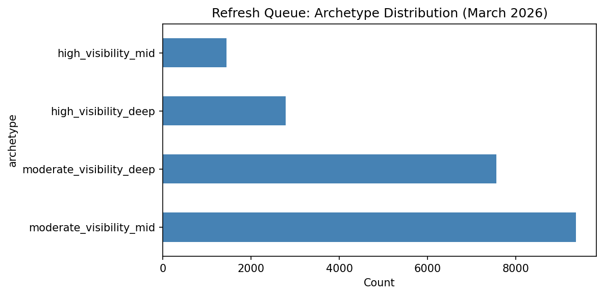
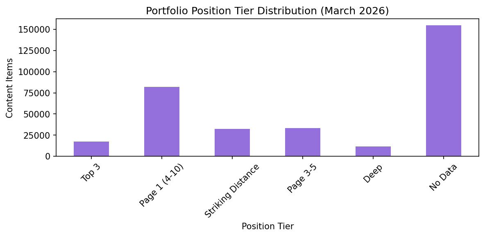

# Prioritizing Content Refresh Review from Search Performance Signals: A Leakage-Audited Baseline vs. ML Comparison

## Abstract

We analyzed 331,437 content items across 55 clients using March 2026 Google Search Console and GA4 data to build a transparent refresh-review prioritization system. We compared a rule-based baseline against Logistic Regression and Random Forest models using a client-grouped 80/20 split, so the test evaluates generalization to unseen clients rather than memorized patterns. The Random Forest achieved perfect precision when trained on features that overlap with the label definition, but collapsed to the base rate once those leaky features were removed — confirming the apparent model strength was label leakage, not learned signal. The honest finding is that the learned models reproduce the transparent baseline rather than discover independent refresh drivers, so we deployed the baseline itself as a ranked action playbook. The playbook includes archetype mapping, human-review rules, and an explicit no-go list for what should never be automated.

## 1. Introduction

Content teams managing large multi-client portfolios need a way to decide which pages are worth a human's time to review for a refresh. This project asks: **can search performance signals reliably flag pages that deserve refresh review, and does a machine learning model add real predictive value over a simple, transparent rule?**

| Property | Value |
|---|---|
| Raw page-day rows | 9,841,378 |
| Decision window | 2026-03-01 to 2026-03-31 |
| Columns in raw export | 30 (GSC + GA4 + engagement signals) |
| Unique clients | 55 |
| Unique content items | 331,437 |
| Total impressions (March) | 280,657,589 |
| Total clicks (March) | 821,832 |

## 2. Data

**Source.** Data comes from the FlyRank ML Internship warehouse (`FlyRank/internship-warehouse` on Hugging Face), combining Google Search Console (GSC) performance data with GA4 engagement signals for a portfolio of client websites.

**Scope and date window.** This analysis is scoped to a single month, **March 2026** (2026-03-01 to 2026-03-31) — the partition provided for this analysis (`fact_content_daily_performance/month=2026-03/`) — rather than the full multi-month warehouse history. Because only one month was available, the analysis cannot separate seasonal effects from underlying trends; this is treated as a stated limitation (Section 5) rather than a design choice made for statistical reasons.

**Grain and volume.** The raw export is page-day level: 9,841,378 rows across 30 columns, covering 331,437 unique content items across 55 unique clients. Aggregated to the page level for March, total impressions were 280,657,589 and total clicks were 821,832.

**Exclusions.** Three categories of data were deliberately excluded from the primary model:
- **GA4 engagement fields** (sessions, pageviews, users, engaged sessions, scroll events) were excluded from the primary feature set due to substantial missingness in this warehouse release. They were retained separately for the leakage audit (Section 4), where they serve as the independent, non-label-derived feature set.
- **Future data.** All features are aggregated only from within the March 2026 window; no post-March signals were used, since every feature must be knowable at the point a prioritization decision would be made.
- **Content-age and freshness fields** (e.g., `content_age`, `days_since_update`) were not available in this warehouse export and are therefore absent from the model entirely, not filtered out after the fact.

No clients or content items were dropped from the 55-client, 331,437-item population; all rows with a valid `client_hash_id`/`content_hash_id` pair in the March partition are included.

**Public-safety note.** No client names, client-identifying URLs, or private search queries appear anywhere in this paper or its supporting artifacts. All figures and tables are aggregated or anonymized.

## 3. Methodology

### 3.1 Assumptions

- Impression and position thresholds are assumed to be comparable across all 55 clients in the portfolio, despite differences in site size, industry, and traffic volume.
- A single calendar month (March 2026) is treated as representative of typical search performance; seasonal or one-off effects within that month are not separated out.
- The eligibility rule is assumed to be a reasonable proxy for "worth a human reviewing this page," not a measure of actual refresh success.

### 3.2 Label definition

```
eligible = (impressions >= 500) AND (avg_position >= 11)
```

A page must show meaningful search visibility (≥ 500 impressions) and sit outside page one (position ≥ 11) to qualify for review.

### 3.3 Baseline score

For eligible items, the priority score is:

```
score = impressions × position_factor
where position_factor = 1.5 if avg_position >= 21 else 1.0
```

Pages deeper in results receive higher weight because they represent larger latent opportunity if moved upward.

### 3.4 Features

- **Leaky feature set:** `impressions`, `clicks`, `avg_position`, `ctr_pct` — includes signals used to construct the label.
- **Honest feature set:** `ga4_sessions`, `ga4_pageviews`, `ga4_users`, `ga4_engaged_sessions`, `scroll_events` — independent of the label rule.

### 3.5 Models

- **Logistic Regression** — median imputation, standardization, `max_iter=1000`, `random_state=42`.
- **Random Forest** — 150 trees, `max_depth=8`, `min_samples_leaf=20`, `random_state=42`.

### 3.6 Validation design

**Client-grouped 80/20 split** (`GroupShuffleSplit`, `random_state=42`). Clients — not individual rows — are assigned to training or testing. This tests whether the model generalizes to unseen clients rather than memorizing client-specific patterns.

**Split result:** 44 training clients, 11 testing clients, **zero client overlap**.

### 3.7 Leakage audit

Because the label is built from `impressions` and `avg_position`, using them as features creates direct feature-label overlap. We performed a **train-without** test: the same Random Forest was trained on the honest GA4-only feature set. If precision collapses, the apparent model strength was circular, not causal.

## 4. Results

### 4.1 Baseline vs. learned models

| Method | Precision@20 | Precision@50 | Precision@100 |
|---|---|---|---|
| Week-4 baseline | 0.05 | 0.16 | 0.16 |
| Logistic Regression | 0.05 | 0.18 | 0.31 |
| Random Forest (with leaky GSC features) | **1.00** | **1.00** | **1.00** |
| Random Forest (without leaky GSC features) | 0.05 | 0.04 | 0.08 |

Test-set base rate: **0.0875**

### 4.2 The leakage confession

The Random Forest achieved perfect precision when trained on features that include the same signals used to construct the eligibility label. To test whether this represents independent predictive skill or circular recovery of the baseline rule, we trained the same model on GA4 and engagement features only — signals that were **not** used to build the label.

The result: precision@20 collapsed from **1.00 to 0.05**, indistinguishable from the base rate. **The apparent model strength was label leakage, not generalizable signal.** The Random Forest learned the arithmetic of the rule (`eligible = impressions >= 500 AND avg_position >= 11`) rather than discovering independent refresh drivers.

### 4.3 Feature importance

With leaky features present, the Random Forest assigns 91.5% of its importance to exactly the two variables used to construct the target:
- `avg_position`: 54.3%
- `impressions`: 37.2%



### 4.4 What this means

The learned models **reproduce** the transparent baseline rather than **surpass** it with hidden insight. This is a **directional, decision-support** result: it confirms the baseline rule is automatable from the same GSC data, but it does not demonstrate that the model predicts refresh success on unseen signal patterns. The honest finding is that the transparent rule is the right tool for this job.





## 5. Limitations

1. **Rule-generated target.** The `eligible` label is constructed from `impressions >= 500` and `avg_position >= 11`. Model performance measures agreement with this transparent rule, not independently observed refresh success.
2. **Single-month snapshot.** March 2026 data only. We cannot measure true content decay, seasonality, or the causal effect of a refresh on post-refresh performance.
3. **No content-age or freshness fields.** The March warehouse export did not include `content_age` or `days_since_update`. Decay insight is inferred from position tiers, not measured from age.
4. **Portfolio-specific thresholds.** The 500-impression and position-11 thresholds were tuned to this 55-client portfolio. Recalibration is needed for a different client mix.
5. **Observational only.** All findings are associative. We observed that pages with certain position and impression patterns match the rule. We do not claim that editing a flagged page will improve its ranking.

## 6. Ranked Recommendations

We produced a ranked refresh queue of **21,143 content items** (6.38% of the portfolio) using the transparent baseline rule. The queue is **decision-support only** — a high rank means "review this first," not "refresh this automatically."

### 6.1 Archetype mapping

| Archetype | Definition | Action | Review Focus |
|---|---|---|---|
| **High-Visibility Deep** | impressions ≥ 5,000, position ≥ 21 | Priority refresh review | Intent match, topical coverage, internal links, competitive gaps |
| **High-Visibility Mid** | impressions ≥ 5,000, position 11–20 | Refresh review | Whether stronger coverage could improve visibility |
| **Moderate-Visibility Deep** | impressions 500–5,000, position ≥ 21 | Targeted refresh review | Relevance and missing topic coverage before investing effort |
| **Moderate-Visibility Mid** | impressions 500–5,000, position 11–20 | Secondary refresh review | Strategic value vs. effort |

### 6.2 Human review rules

Before acting, a reviewer must confirm:
- The page still matches intended search intent.
- The topic is still relevant to the business.
- The page has realistically improvable content.
- Technical or indexing issues are not the true cause of poor position.
- The page does not carry a manual "do not touch" flag from legal, product, or PR.

### 6.3 No-go list: what should never be automated

- Auto-publish rewritten content
- Auto-delete or auto-redirect pages
- Change canonical URLs, titles, or meta descriptions from the score alone
- Remove content because of low impressions alone
- Override manual editorial holds or make business decisions without human review

The model **flags candidates**. Humans **decide actions**.

### 6.4 Cost/value thinking

Editorial hours are assumed limited. The queue prioritizes high-impression pages first because they represent the largest recoverable search opportunity per unit of review effort. This framework supports prioritization; it does not estimate financial ROI.





## 7. Reproducibility

All analysis code, data loading, and exports are contained in the following notebooks:

- `work/notebooks/capstone.ipynb` — this paper's backing analysis
- `work/notebooks/w05_model.ipynb` — model training and comparison
- `work/notebooks/w06_validation_audit.ipynb` — leakage audit and train-without test
- `work/notebooks/w07_action_playbook.ipynb` — ranked queue and archetype mapping

The data source is the FlyRank internship warehouse (`FlyRank/internship-warehouse` on Hugging Face).

## Acknowledgments & Data Credit

Built on the **FlyRank ML Internship dataset**.
[https://flyrank.ai](https://flyrank.ai)